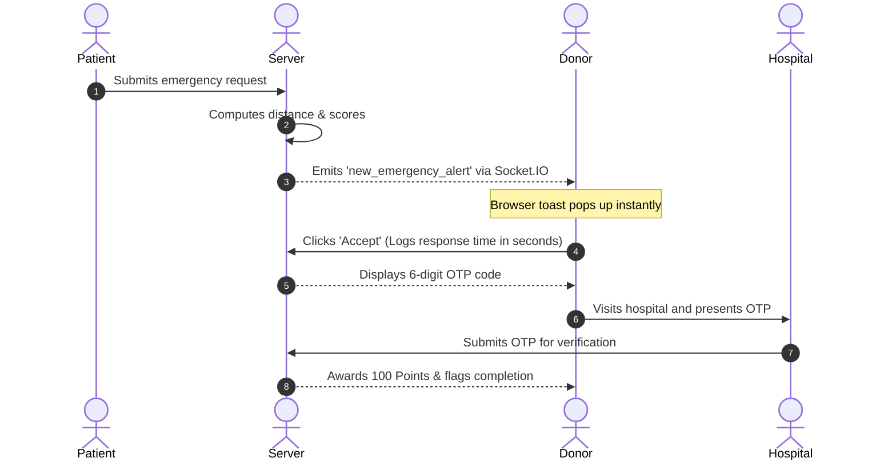

# Blood Need - Project Explanation Document

Welcome to the **AI-Powered Real-Time Blood Donor Matching and Emergency Response System** project documentation. This document details the system goals, architecture, data schemas, algorithmic details, and end-to-end workflows of the application.

---

## 🌟 Project Overview
The core objective of the **Blood Need** platform is to minimize blood delivery delays during medical emergencies. Rather than broadcasting generic alerts, the system uses geographical proximity, donor response history, and blood compatibility matrices to instantly identify, rank, and notify the most suitable donors.

---

## 🏗️ Architecture & Technology Stack

The application follows a decoupled client-server architecture:

```
┌────────────────────────────────────────┐
│               Frontend                 │
│  (HTML5, Vanilla CSS, JavaScript)      │
│  Portals: Patient, Donor, Hospital     │
└───────────────────┬────────────────────┘
                    │
           HTTP / WebSockets
                    │
┌───────────────────▼────────────────────┐
│         Backend (Flask API)            │
│  - JWT Authentication (Flask-JWT)      │
│  - Real-Time Alerts (Flask-SocketIO)   │
│  - DB ORM (Flask-SQLAlchemy)           │
└───────────────────┬────────────────────┘
                    │
            SQL Queries / ORM
                    │
┌───────────────────▼────────────────────┐
│      Database (MySQL / SQLite)         │
│  Stores Users, Requests, MatchLogs     │
└────────────────────────────────────────┘
```

- **Frontend**: Vanilla CSS for layouts (with glassmorphism and HSL-based palettes), WebSocket client integration (Socket.IO client), and dynamic DOM rendering.
- **Backend**: Python Flask REST API wrapped in a WebSocket server (using gevent/eventlet/eventlet-websocket wrapper).
- **Database**: Works on a production-ready **MySQL** database. Includes an automatic local **SQLite** database fallback (`blood_need.db`) for developer ease-of-use.

---

## 💾 Database Schema Details

The database is built around three core user roles and request logs:

### 1. User Tables
- **`patients`**: Stores patient profile details and hospital names.
- **`donors`**: Stores donor profiles, blood groups, geographical coordinates (lat/lng), availability status, total points, and historical response rate.
- **`hospitals`**: Stores hospital profiles used to verify donations and review response stats.

### 2. Request & Match Tables
- **`blood_requests`**: Stores request details (blood group, units needed, urgency, coordinates, requesting patient/hospital, and status).
- **`donor_matches`**: Represents dispatches between requests and compatible donors.
  - `matched_at`: Logged when the proximity matching runs.
  - `response_time_seconds`: Measures exact seconds elapsed between `matched_at` and the donor's decision.
  - `otp`: A secure 6-digit code generated when a donor accepts.
  - `status`: Tracking flag (`Pending`, `Accepted`, `Rejected`, `Verified`).

---

## 🧮 Core System Logic

### 1. Blood Compatibility Matrix
The system uses a strict donor-recipient compatibility lookup before calculating distance:
- **O-** is treated as a universal donor.
- **AB+** is treated as a universal recipient.
- Otherwise, recipients only match with compatible donor types (e.g., A+ recipient matches with A+, A-, O+, O-).

### 2. Geo-Proximity Filter (Haversine Formula)
Uses coordinates to compute the great-circle distance between donor location $(lat_1, lng_1)$ and hospital location $(lat_2, lng_2)$ in kilometers:

$$\Delta lat = lat_2 - lat_1$$
$$\Delta lng = lng_2 - lng_1$$
$$a = \sin^2\left(\frac{\Delta lat}{2}\right) + \cos(lat_1) \cdot \cos(lat_2) \cdot \sin^2\left(\frac{\Delta lng}{2}\right)$$
$$c = 2 \cdot \text{atan2}\left(\sqrt{a}, \sqrt{1-a}\right)$$
$$\text{Distance} = R \cdot c \quad (\text{where } R = 6371 \text{ km})$$

- **15km Cutoff**: Any compatible donor located further than **15.0 km** is automatically excluded from the match group.

### 3. Multi-Factor Scoring Engine
Compatible donors within 15km are prioritized using a weighted score:

$$\text{Score} = (40 \times \text{Proximity Points}) + (30 \times \text{Response Rate Fraction}) + (30 \times \text{Availability Status})$$

- **Proximity Points**: Scaled score where closer distance = higher points (Max 40 points).
- **Response Rate**: Scale of 0 to 100 based on donor's past decisions (Max 30 points).
- **Availability Status**: `1` if available (30 points), `0` if unavailable (0 points).

---

## 💬 Real-Time Notification & Response Cycle



---

## 🏃 Running the Project Locally

### 1. Start Backend Server
```bash
cd BloodNeed-Backend
python run.py
```
*Runs Flask on http://127.0.0.1:5000*

### 2. Start Frontend Server
```bash
cd BloodNeed-Frontend
python -m http.server 8080
```
*Serves static pages on http://127.0.0.1:8080*

### 🔑 Default Test Accounts
Password for all accounts is **`Test@123`**:
- **Hospital**: `analytics_hospital@example.com`
- **Patient**: `patient@example.com`
- **Donor**: `donor_a@example.com` (Available, 5km away, A+)
